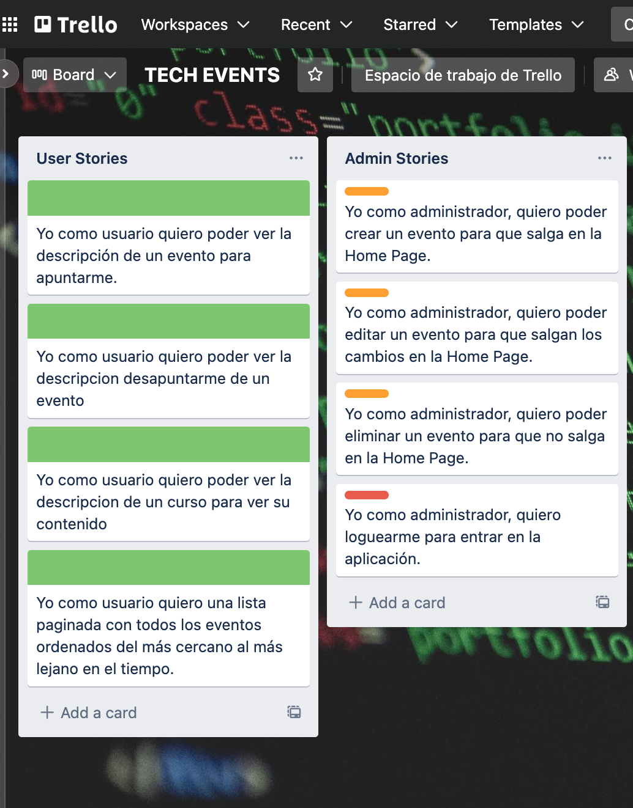
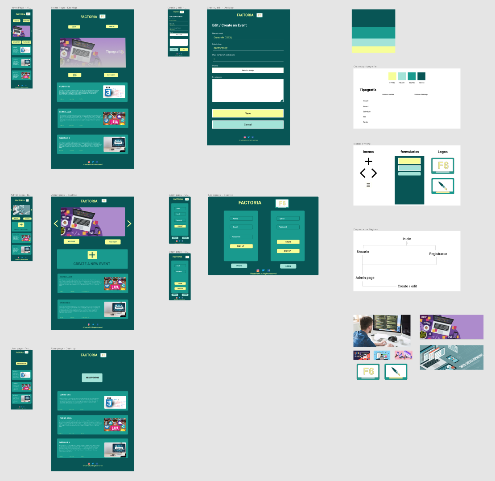
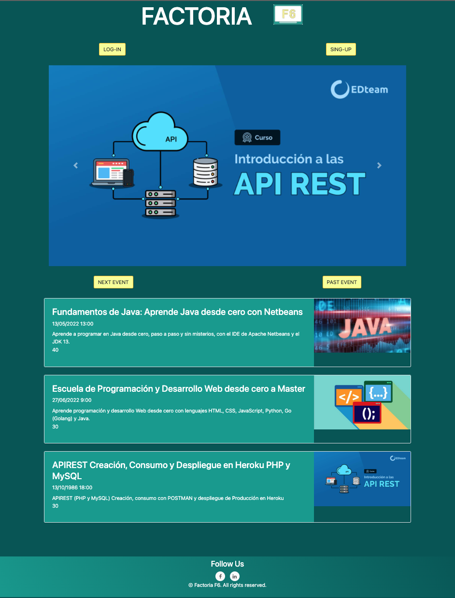
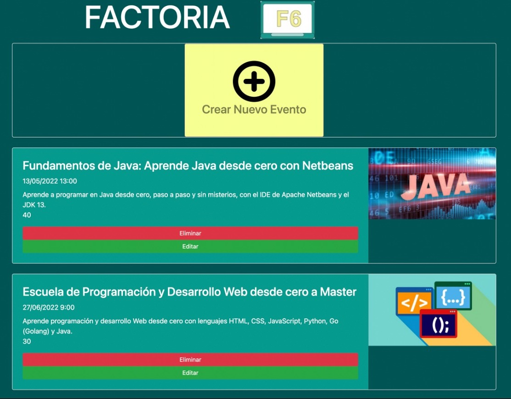

# 

Website dedicated to offer web development courses

## Starting 🚀

- Clone or download Git Repository.
- Paste or unzip https://github.com/jesusod/Tech_Events
- Open the intelliJ idea.
- Enjoy.

See **Installation** to learn how to deploy the project.

### Requeriments 📋

- intelliJ idea.
- MySQL.
- Browser.

### Installation 🔧

- Open intelliJ idea.
- Git clone https://github.com/jesusod/Tech_Events
- Open-start your mysql GUI.
- Enjoy.

### Coding style tests ⌨️

Verifies the proper functioning of the web with the technologies applied to it.

# 
# 
# 
# 

## Made with 🛠️

* [Trello](https://trello.com/b/LAXZpvTz/123-coders) - Project Organization.
* [Balsamiq](https://balsamiq.cloud/s5tauor/p75s6vf/rDB97) - Wireframe
* [intelliJ IDEA](https://www.jetbrains.com/es-es/idea/)
* [Figma](https://www.figma.com/file/uDFYrQYkMYordGhM3zFO60/Wheel-of-doom) - The web framework used.
* [Git & GitHub](https://github.com) - Keeping track of changes in computer files including coordinating team work.
* [Canva](https://www.canva.com/)
* [XAMPP](https://www.apachefriends.org/es/index.html)
* [TablePlus for MAC](https://tableplus.com/)

## Versions 📌

For all available versions, see the [tags in this repository](https://github.com/checkmyprojects/wheel-of-doom.git).

## Autors ✒️

[Guadalupe Flores](https://github.com/Lupe13)
[Carlos Laurie](https://github.com/CarlitosHunter)
[Paula de Juan](https://github.com/PAULAdjs1)
[Jesús Otero](https://github.com/jesusod)
[Fran Domínguez](https://github.com/devFdom)

## License 📄

This project is licensed under the (Factoría F6) License - see the file [LICENSE.md](LICENSE.md) for details.

## Thanks 🎁

* Tell others about this project 📢
* Invite someone from the team to a beer 🍺 or a coffee ☕. If you are very grateful, an Vespita 🛵, Audi or BMW 🚗 we accept it too.
* Give thanks publicly 🤓.
* etc.

---
